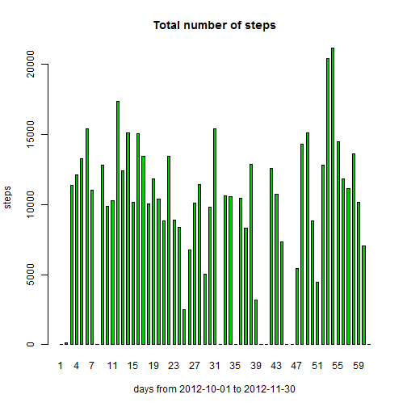
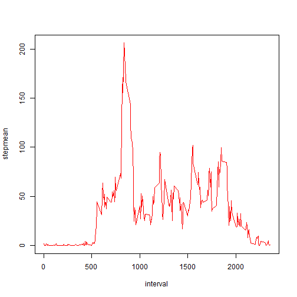
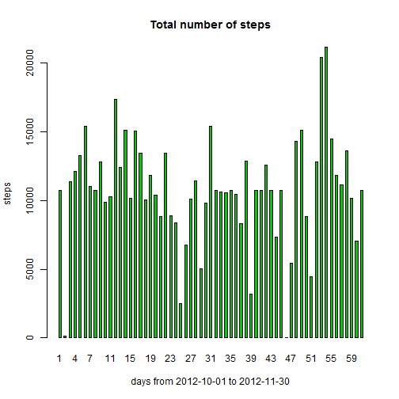
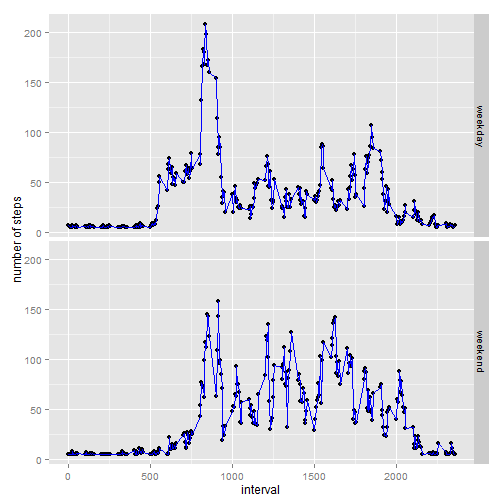

###Assignment

This assignment will be described in multiple parts. You will need to write a
report that answers the questions detailed below. Ultimately, you will need to
complete the entire assignment in a single R markdown document that can
be processed by knitr and be transformed into an HTML file.

Throughout your report make sure you always include the code that you used to
generate the output you present. When writing code chunks in the R markdown
document, always use echo = TRUE so that someone else will be able to read
the code. This assignment will be evaluated via peer assessment so it
is essential that your peer evaluators be able to review the code for
your analysis.

For the plotting aspects of this assignment, feel free to use any plotting system
in R (i.e., base, lattice, ggplot2)

Fork/clone the GitHub repository created for this assignment. You will submit
this assignment by pushing your completed files into your forked repository on
GitHub. The assignment submission will consist of the URL to your GitHub
repository and the SHA-1 commit ID for your repository state.

NOTE: The GitHub repository also contains the dataset for the assignment so
you do not have to download the data separately.


####Loading and preprocessing the data


Show any code that is needed to:

1. Load the data (i.e. read.csv())


```r
setwd("G:/Xavier/Estudios/Online/Data Science/5 Reproducible Research/working directory XV")
data<-read.csv("activity.csv")
```

2. Process/transform the data (if necessary) into a format suitable for your analysis


```r
data$date<-as.Date(data$date)
head(data)
```

```
##   steps       date interval
## 1    NA 2012-10-01        0
## 2    NA 2012-10-01        5
## 3    NA 2012-10-01       10
## 4    NA 2012-10-01       15
## 5    NA 2012-10-01       20
## 6    NA 2012-10-01       25
```

```r
library(dplyr)
```

```
## 
## Attaching package: 'dplyr'
## 
## The following object is masked from 'package:stats':
## 
##     filter
## 
## The following objects are masked from 'package:base':
## 
##     intersect, setdiff, setequal, union
```


####What is mean total number of steps taken per day?


For this part of the assignment, you can ignore the missing values in the dataset.

1. Make a histogram of the total number of steps taken each day


```r
byday<-group_by(data,date)
x<-summarize(byday,sum(steps, na.rm=TRUE))
names(x)<-c("date","stepsum")
days<-c(1:nrow(x))
x$daynumber<-days
head(x)
```

```
## Source: local data frame [6 x 3]
## 
##         date stepsum daynumber
## 1 2012-10-01       0         1
## 2 2012-10-02     126         2
## 3 2012-10-03   11352         3
## 4 2012-10-04   12116         4
## 5 2012-10-05   13294         5
## 6 2012-10-06   15420         6
```

```r
from<-as.character(as.matrix(x[1,1]))
to<-as.character(as.matrix(x[nrow(x),1]))
xlabel<-paste("days from",from,"to",to)
barplot(x$stepsum,space=1,xlab=xlabel,ylab="steps", main="Total number of steps",names.arg=days,col=3)
```

 

2. Calculate and report the mean and median total number of steps taken per day


```r
mean(x$stepsum, na.rm=TRUE)
```

```
## [1] 9354.23
```

```r
median(x$stepsum, na.rm=TRUE)
```

```
## [1] 10395
```


####What is the average daily activity pattern?


1. Make a time series plot (i.e. type = "l") of the 5-minute interval (x-axis) and the average number of steps taken, averaged across all days (y-axis)


```r
byinterval<-group_by(data,interval)
x<-summarize(byinterval,mean(steps, na.rm=TRUE))
names(x)<-c("interval","stepmean")
head(x)
```

```
## Source: local data frame [6 x 2]
## 
##   interval  stepmean
## 1        0 1.7169811
## 2        5 0.3396226
## 3       10 0.1320755
## 4       15 0.1509434
## 5       20 0.0754717
## 6       25 2.0943396
```

```r
plot(x, type = "l",col=2)
```

 

2. Which 5-minute interval, on average across all the days in the dataset, contains the maximum number of steps?


```r
x$interval[which.max(x$stepmean)]
```

```
## [1] 835
```


####Imputing missing values


Note that there are a number of days/intervals where there are missing values (coded as NA). The presence of missing days may introduce bias into some calculations or summaries of the data.

1. Calculate and report the total number of missing values in the dataset (i.e. the total number of rows with NAs)


```r
nrow(data)-nrow(data[complete.cases(data),])
```

```
## [1] 2304
```

2. Devise a strategy for filling in all of the missing values in the dataset. The strategy does not need to be sophisticated. For example, you could use the mean/median for that day, or the mean for that 5-minute interval, etc.
3. Create a new dataset that is equal to the original dataset but with the missing data filled in.


```r
byday<-group_by(data,date)
x<-summarize(byday,mean(steps, na.rm=TRUE))
names(x)<-c("date","stepmean")
alldaysmean<-mean(x$stepmean, na.rm=TRUE)
#Replace rows with steps = NA with alldaysmean
dataor<-data
rows<-c(1:nrow(data))
for(row in rows) {
  if(is.na(data[row,1])) {
  	data[row,1]<-alldaysmean
	}
}
```

4. Make a histogram of the total number of steps taken each day and Calculate and report the mean and median total number of steps taken per day. Do these values differ from the estimates from the first part of the assignment? What is the impact of imputing missing data on the estimates of the total daily number of steps?


```r
byday<-group_by(data,date)
x<-summarize(byday,sum(steps, na.rm=TRUE))
names(x)<-c("date","stepsum")
days<-c(1:nrow(x))
x$daynumber<-days
from<-as.character(as.matrix(x[1,1]))
to<-as.character(as.matrix(x[nrow(x),1]))
xlabel<-paste("days from",from,"to",to)
barplot(x$stepsum,space=1,xlab=xlabel,ylab="steps", main="Total number of steps",names.arg=days,col=3)
```

 

**Mean and median:**


```r
mean(x$stepsum, na.rm=TRUE)
```

```
## [1] 10766.19
```

```r
median(x$stepsum, na.rm=TRUE)
```

```
## [1] 10766.19
```


####Are there differences in activity patterns between weekdays and weekends?


For this part the weekdays() function may be of some help here. Use the dataset with the filled-in missing values for this part.


1. Create a new factor variable in the dataset with two levels - "weekday" and "weekend" indicating whether a given date is a weekday or weekend day.


```r
data$day<-weekdays(data$date)
data$weekend<-"weekday"
head(data)
```

```
##     steps       date interval   day weekend
## 1 37.3826 2012-10-01        0 lunes weekday
## 2 37.3826 2012-10-01        5 lunes weekday
## 3 37.3826 2012-10-01       10 lunes weekday
## 4 37.3826 2012-10-01       15 lunes weekday
## 5 37.3826 2012-10-01       20 lunes weekday
## 6 37.3826 2012-10-01       25 lunes weekday
```

```r
rows<-c(1:nrow(data))
for(row in rows) {
	if(data[row,4]=="sábado" || data[row,4]=="domingo") {
		data[row,5]<-"weekend"
	}
}
```


2. Make a panel plot containing a time series plot (i.e. type = "l") of the 5-minute interval (x-axis) and the average number of steps taken, averaged across all weekday days or weekend days (y-axis). The plot should look something like the following, which was creating using simulated data.


```r
byinterval<-group_by(data,weekend,interval)
x<-summarize(byinterval,mean(steps, na.rm=TRUE))
names(x)<-c("weekend","interval","stepmean")
library(ggplot2)
sp<-qplot(interval,stepmean,data=x,ylab="number of steps",type = "l")
sp + facet_grid(weekend ~ .) + geom_line(colour="blue")
```

 


